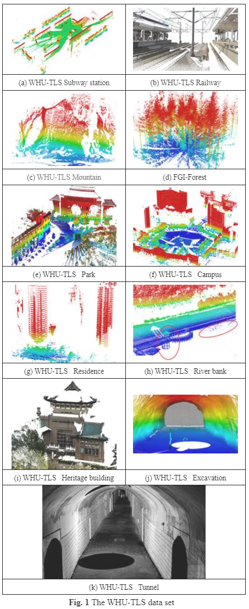
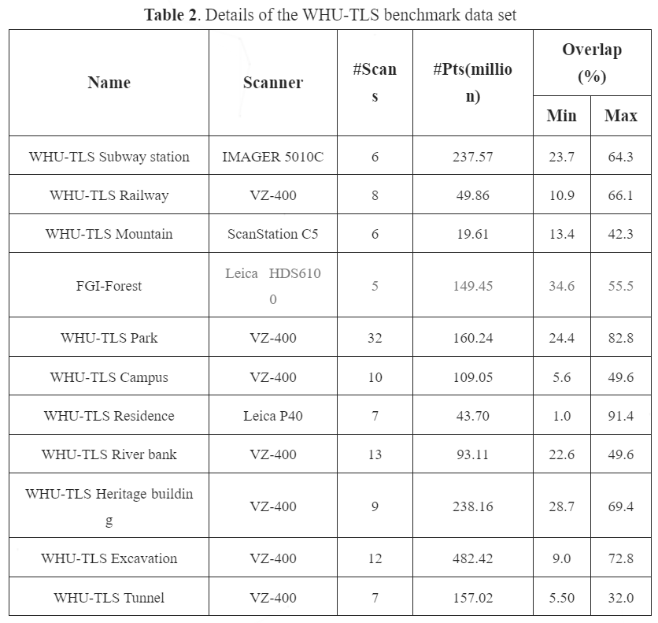

<h1 align="center"> <p>😄 WHU-TLS</p></h1>
<h3 align="center">
<a href="https://www.sciencedirect.com/science/article/pii/S0924271620300836/pdfft?md5=2f45285819042c3d70c2b380d63237cc&pid=1-s2.0-S0924271620300836-main.pdf" target="_blank">Registration of large-scale terrestrial laser scanner point clouds: A review and benchmark</a>
</h3>

<h3 align="center">
ISPRS J 2020; ESI highly cited
</h3>

<h4 align="center">
Zhen Dong<sup>1</sup>, Fuxun Liang<sup>1</sup>, Bisheng Yang<sup>&dagger;,1</sup>, Yusheng Xu<sup>2</sup>, Yufu Zang<sup>3</sup>, Jianping Li<sup>1</sup>, Yuan Wang<sup>1</sup>, Wenxia Dai<sup>1</sup>, Hongchao Fan<sup>&dagger;,4</sup>, Juha Hyyppä<sup>5</sup>, Uwe Stilla<sup>2</sup>
</h4>

<h5 align="center">
<sup>1</sup>State Key Laboratory of Information Engineering in Surveying, Mapping and Remote Sensing, Wuhan University &nbsp;&nbsp; <br>
<sup>2</sup>Photogrammetry and Remote Sensing, Technical University of Munich &nbsp;&nbsp; <br>
<sup>3</sup>School of Remote Sensing & Geomatics Engineering, Nanjing University of Information Science & Technology &nbsp;&nbsp; <br>
<sup>4</sup>Department of Civil and Environmental Engineering, Norwegian University of Science and Technology &nbsp;&nbsp; <br>
<sup>5</sup>Department of Remote Sensing and Photogrammetry, Finnish Geospatial Research Institute &nbsp;&nbsp; <br>
<sup>&dagger;</sup>Corresponding authors. &nbsp;&nbsp; 
</h5>


The benchmark WHU-TLS consists of 115 scans and in total over 1740 million 3D points collected from 11 different environments (i.e., subway station, high-speed railway platform, mountain, forest, park, campus, residence, riverbank, heritage building, underground excavation and tunnel) with varying point density, clutter, and occlusion. The ground-truth transformations, the transformations calculated by [Dong et. al. (2018)](https://www.sciencedirect.com/science/article/abs/pii/S0924271618301813) and the registration graphs are also provided for researchers, which aims to yield better comparisons and insights into the strengths and weaknesses of different registration approaches on a common base. We hope the benchmark meets the needs of the research community and becomes an important dataset for the development of cutting-edge TLS point cloud registration methods. In addition, the proposed benchmark also provides suitable datasets for the applications of safe railway operation, river survey and regulation, forest structure assessment, cultural heritage conservation, landslide monitoring and underground asset management.

## 💡 Download Link
Please fill out this [Data Request](http://3s.whu.edu.cn/ybs/en/Data_Request.htm). We will sent the download links to you.

## 📂 Related Open Source Projects
Check our works on point cloud registration:
- Pairwise Registration
  - 📂[BSC (ISPRS J'17)](https://github.com/YuePanEdward/GH-ICP/blob/master/include/binary_feature_extraction.hpp)
  - 📂[YOHO (ACM MM'22)](https://github.com/HpWang-whu/YOHO)
  - 📂[RoReg (TPAMI'23)](https://github.com/HpWang-whu/RoReg)
- Multiview Registration
  - 📂[SGHR (CVPR'23)](https://github.com/WHU-USI3DV/SGHR)


## 📌 Benchmark Details
The benchmark data sets are shown in Fig.1. Table 2 shows the detailed descriptions of the WHU-TLS data sets in terms of the data acquisition equipment, number of scans, number of points, range covered, organization of the environment, location of the environment, and the minimum and maximum overlaps between pairwise point clouds. For more details, please check our [paper](https://www.sciencedirect.com/science/article/abs/pii/S0924271620300836)!






## 💡 Citation

Please consider citing the following papers when utilizing WHU-TLS or finding that the following projects benefit your work:

```
@article{dong2017novel,
  title={A novel binary shape context for 3D local surface description},
  author={Dong, Zhen and Yang, Bisheng and Liu, Yuan and Liang, Fuxun and Li, Bijun and Zang, Yufu},
  journal={ISPRS Journal of Photogrammetry and Remote Sensing},
  volume={130},
  pages={431--452},
  year={2017},
  publisher={Elsevier}
}

@article{dong2020registration,
  title={Registration of large-scale terrestrial laser scanner point clouds: A review and benchmark},
  author={Dong, Zhen and Liang, Fuxun and Yang, Bisheng and Xu, Yusheng and Zang, Yufu and Li, Jianping and Wang, Yuan and Dai, Wenxia and Fan, Hongchao and Hyypp{\"a}, Juha and others},
  journal={ISPRS Journal of Photogrammetry and Remote Sensing},
  volume={163},
  pages={327--342},
  year={2020},
  publisher={Elsevier}
}

@article{dong2018hierarchical,
  title={Hierarchical registration of unordered TLS point clouds based on binary shape context descriptor},
  author={Dong, Zhen and Yang, Bisheng and Liang, Fuxun and Huang, Ronggang and Scherer, Sebastian},
  journal={ISPRS Journal of Photogrammetry and Remote Sensing},
  volume={144},
  pages={61--79},
  year={2018},
  publisher={Elsevier}
}

@inproceedings{wang2022you,
  title={You only hypothesize once: Point cloud registration with rotation-equivariant descriptors},
  author={Wang, Haiping and Liu, Yuan and Dong, Zhen and Wang, Wenping},
  booktitle={Proceedings of the 30th ACM International Conference on Multimedia},
  pages={1630--1641},
  year={2022}
}

@article{wang2023roreg,
  title={RoReg: Pairwise Point Cloud Registration with Oriented Descriptors and Local Rotations},
  author={Wang, Haiping and Liu, Yuan and Hu, Qingyong and Wang, Bing and Chen, Jianguo and Dong, Zhen and Guo, Yulan and Wang, Wenping and Yang, Bisheng},
  journal={IEEE Transactions on Pattern Analysis and Machine Intelligence},
  year={2023},
  publisher={IEEE}
}

@inproceedings{
wang2023robust,
title={Robust Multiview Point Cloud Registration with Reliable Pose Graph Initialization and History Reweighting},
author={Haiping Wang and Yuan Liu and Zhen Dong and Yulan Guo and Yu-Shen Liu and Wenping Wang and Bisheng Yang},
booktitle={Conference on Computer Vision and Pattern Recognition},
year={2023}
}
```


